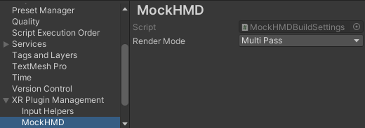

# About the Mock HMD XR Plugin

The Mock HMD XR Plugin enables you to build VR applications without a device.

It provides stereo rendering support by mimicking the display properties of an HTC Vive HMD.

## Requirements

This version of Mock HMD is compatible with the following versions of the Unity Editor:

* 2022.3 LTS+

## XR plugin systems

### Display

Display supports all graphics APIs for basic stereo rendering support.

### Input

Input is not supported. It's up to your application to mock input by moving the camera's parent, or providing its own Tracked Pose Driver source.

## Getting started

Add the Mock HMD Loader to XR Management.

Enter Play mode. Select the Game view render mode from the drop-down above the Game view.

## Game view blit modes

* **Left Eye** - Just the left eye, cropped to the center of the image.
* **Right Eye** - Just the right eye, cropped to the center of the image.
* **Both Eyes** - Both eyes, cropped and displayed side-by-side.
* **Occlusion Mesh** - Full left and right eyes, shown side-by-side as they would be submitted to the compositor. Uses Vive's occlusion mesh.

Use the API [XRSettings.gameViewRenderMode](https://docs.unity3d.com/ScriptReference/XR.XRSettings-gameViewRenderMode.html) to control the blit mode at runtime for the built-in renderer. Scriptable Render Pipelines control the blit mode themselves.

## Stereo render modes

The mock HMD supports the following stereo rendering modes:

* **MultiPass** - Submit separate draw calls for each eye.
* **SinglePassInstanced** - Submit one draw call for both eyes.

You can set the render mode at build time in the **Project Settings** window (from Unity's main menu, go to. **Edit &gt; Project Settings**, then select the **XR Plugin Management &gt; MockHMD** category from the menu on the left.  The setting will take effect in play mode.

You can also set the render mode at runtime using `MockHMD.SetRenderMode`. Be sure to reference the `Unity.XR.MockHMD` asmdef + namespace.

## Foveated Rendering

To learn about foveated rendering in XR, review  the [Foveated Rendering](https://docs.unity3d.com/6000.0/Documentation/Manual/xr-foveated-rendering.html) page in the Unity manual.

> [!NOTE]
> Foveated rendering is only available for MockHMD using DirectX 12 and Vulkan.

### Set runtime foveated rendering level

To enable foveated rendering, you must first set the foveated rendering level at runtime. To understand how to do this, follow the instructions in [Control foveated rendering](https://docs.unity3d.com/6000.0/Documentation/Manual/xr-foveated-rendering.html#control-foveated-rendering).

### Enable foveated rendering

To enable a simulation of foveation on MockHMD:

1. Open the **MockHMD** section of the **XR Plug-in Management** settings (menu: **Edit** > **Project Settings** > **XR Plug-in Management**).
2. Enable the **Foveation Enabled** checkbox.

 *Foveation Enabled in the MockHMD settings.*

### Gaze Simulation Mode

 *Gaze Simulation Mode dropdown in the MockHMD settings.*

The mock HMD supports several ways to simulate eye motion in the simulator:

* **Disabled** and **Static Center** - Foveation will appear in the center of each eye.
* **Movement Left Right** - Foveation will move from left to right, in each eye.
* **Movement Eye Independent** - Foveation will be independent between each eye.

You will notice a lower-resolution 'edge' in the rendered image that delineates the edge of the foveated area. For example, with **Static Center** you will observe the following:

 *Foveation Example in the active GameView.*

You can also begin to see the effects of foveation along the bottom of the rendered image.

You can see the effect more dramatically if you choose **Movement Left Right**.
